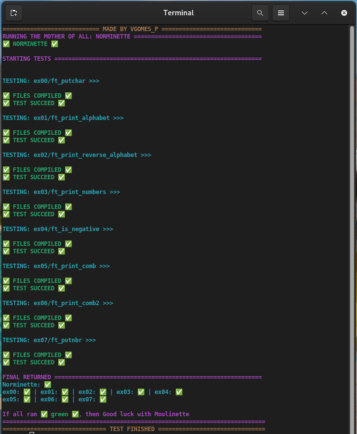

# piscine-testers-42
### These are simple testers for the 42 Piscine process

> Hi 42, I know you are seeing this, before taking my repo down, call me and request to remove anything you'll think is not being cool to be here. thnks S2



# How to use the testers
## 1 - Clone this repository to your home (do not change the name)
```bash
git clone https://github.com/vgomes-p/piscine-testers-42.git
```

## 2 - Define all the test from ~/c-piscine-42/TESTERS/EXECS as alias
### For ZSH and BASH (probably the Shell you use in 42):
#### 2.1 - Open .zshrc or .bashrc
```bash
nano ~/.zshrc
```
or
```bash
nano ~/.bashrc
```

#### 2.2 - Pass the following code at the end of the file
```bash
alias test_shell00="~/piscine-testers-42/TESTERS/EXECS/exec_shell00.sh"
alias test_shell01="~/piscine-testers-42/TESTERS/EXECS/exec_shell01.sh"
alias test_c00="~/piscine-testers-42/TESTERS/EXECS/exec_c00.sh"
alias test_c01="~/piscine-testers-42/TESTERS/EXECS/exec_c01.sh"
alias test_c02="~/piscine-testers-42/TESTERS/EXECS/exec_c02.sh"
alias test_c03="~/piscine-testers-42/TESTERS/EXECS/exec_c03.sh"
alias test_c04="~/piscine-testers-42/TESTERS/EXECS/exec_c04.sh"
```

#### 2.3 - Exit the file
`2.3.1 - CTRL^X`

`2.3.2 - Y`

`2.3.3 - ENTER`

#### 2.3 - Update the zsh or bash

```bash
source ~/.zshrc
```
or

```bash
source ~/.bashrc
```

## 3 - Get to the root of the list you want to test
```bash
cd 42_piscine/c0
```

## 4 - Call the test
```bash
test_c00
```

# Note
### These testers do not test all the scenarios for the exercises. But they are the tests I made on my own code before approving them...
